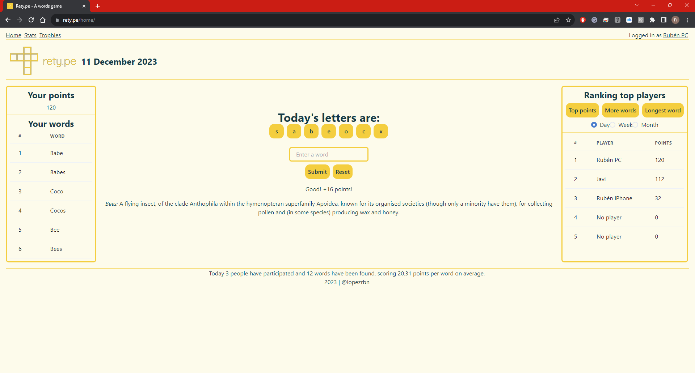

# Rety.pe  - A game of words
> Rety.pe is a browser word-finding game given seven letters that change every day.



[Rety.pe](https://rety.pe/) is a word-finding game but it was originally developed as a project to be exposed in my portfolio as a Data Scientist, to demonstrate key abilities and knowledge in this field.

Specifically, the Rety.pe project gathers all the parts surrounding the deployment of any data science project that needs to be distributed to the public after its development.

These parts are:

- Development of a web app as UI
   - Front and back-end developed using [Reflex](https://reflex.dev/), a new technology that allows building web apps in pure Python.
   - Development of the full control logic of the game using Python.
- Deployment of the web page via self-hosting in a VPS
   - Configuration of the server with a stack using Linux (Ubuntu 23.10), Nginx, MySQL and Python.
   - Configuration of Nginx as a web server using reverse proxy and WebSockets to communicate front with back-end.
   - Configuration of Reflex as a system service to run indefinitely as a background process.
- Creation of a database using MySQL
   - Creation of the database, designing structure, tables, columns and data types.
   - Hosting of the database in the VPS.
   - Configuration of the communication between the database and web app using MySQLConnector/Python.
   - Design of all the SQL queries needed to serve the data to the web app.

Other aspects used in Rety.pe project:

- Use of an open-source dictionary API to check the introduced words
   - Credits to [Free Dictionary API](https://dictionaryapi.dev/)
- Use of cookies to remember the player's name and information about the session.
- Use of [Brand Kit Generator](https://www.hubspot.com/brand-kit-generator) web tool to design the web logo, colors, fonts, etc.


Previous versions of the project also used:

- Flask/Python for the back end.
- Google Cloud Platform for the deployment.
- Google's Firebase to develop a login system using email/password or integration with Google email.


## Cloning the repository

Clone the repository in your local directory:

```
git clone https://github.com/lopezrbn/retype.git
```

Then open the folder in your preferred IDE (examples are taken from Visual Studio Code)


## Edit of configuration files

Once the virtual environment is set up, the next step is to edit three specific configuration files: `rxconfig-example.py`, `db_connection-example.py` and `db_creation_example.py`.

### rxconfig-example.py file

This is the file that tells Reflex how to build your project. An example file is supplied, but it will be needed to adapt it to your project specifics.

The example file is configured to be valid in both configurations: local testing in development mode; and final build in production mode to be hosted in the server. For the moment we will only cover the development mode, so changes to this file will be minimal. Later in this tutorial, we will see the deployment of the app in a VPS.

Then the only change made to this file will be renaming it from `rxconfig-example.py` to `rxconfig.py`.

### db_connection-example.py file

This file holds the data to make the connection with your database. For security reasons, an example blank file is supplied, so it will be needed to customize it with the data of your database.

Then the changes are:
1. Rename the file from `db_connection-example.py` to just `db_connection.py`. Then, open the file.
2. Enter the user to access the database. The default value is usually `"root"`, but take whatever it works for you.
3. Enter the host in which the database will be stored. If it is going to be stored in the same machine you will be running Reflex, just use `"localhost"`. Otherwise, just use the IP of the server in which the database will be stored.
4. Enter the name of your database. The default value used for the project is `"retype"`, but again use whatever works for you.
5. Finally, enter the password for your database.


### db_creation-example.py file

This script is designed to be executed once and create the database structure and tables.

This tutorial assumes MySQL is properly installed and configured in the system using the credentials defined in the above file `db_connection.py`. A new tutorial will be developed to go deeper into the installation and configuration of MySQL.

Again an example file is supplied which will be needed to modify.

The changes are:
1. Go to your favourite MySQL client and create the database: CREATE DATABASE retype;
2. Finally, execute the script. Being located in the parent directory of the project:

   ```
   cd retype
   ```
   ```
   python3 db_creation.py
   ```


## Creation of virtual environment and installation of requirements

To assure the compatibility of the project with every system, we will use a virtual environment in which we will install all the required dependencies.

Firstly, install reflex and after that install virtualenv:
```
pip install virtualenv
```

Then, we create a virtual environment using `venv`, and call it `myvenv`:
```
python3 -m venv myvenv
```

Now, activate the virtual environment:

> Linux/MAC:   
```
source myvenv/bin/activate
```
> Windows:
```
.\myvenv\Scripts/activate
```

Finally, installation of requirements:
```
pip install -r requirements.txt
```


## Running of Reflex

Once at this point, the project is configured to be run and show the web app in a local environment.

Just go to your terminal and:
1. Make `reflex init` to initialize Reflex. This will create a whole structure of new folders and files with everything that Reflex needs to render your web app after compilation. 
2. Then `reflex run` to initialize compilation.
   1. Reflex will start the compilation and you will see something similar to the following:
   
   2. Then, you will see a lot of queries connecting to the database (only a part shown in the screenshot):
   
   3. And a message showing the beginning of the compilation process:
   
   4. Then again the query messages when the project reloads, and the message:
   
3. So you just finally need to open your browser and go to [http://localhost:3000](http://localhost:3000) to see the web app running.


## Next steps

Once your app is running locally, the next step would be to deploy it to a server so it can be accessed by any user via the Internet.

To not make this tutorial too long, a new one will be developed to show how to configure the whole process.


## Release History

* 0.1.0
    * First release of the game
 

## Acknowledgements

Special thanks to Javi López @javilopezg for giving me the idea of developing the game as a consolidation project to all the additional knowledge needed to deploy a data science solution, but especially for acting as my mentor during this time, guiding both the professional and the personal path. Thanks, buddy!


## Contact

Rubén López – <lopezrbn@gmail.com>

Distributed under the XYZ license. See ``LICENSE`` for more information.

[https://github.com/lopezrbn/words](https://github.com/lopezrbn/words/)
